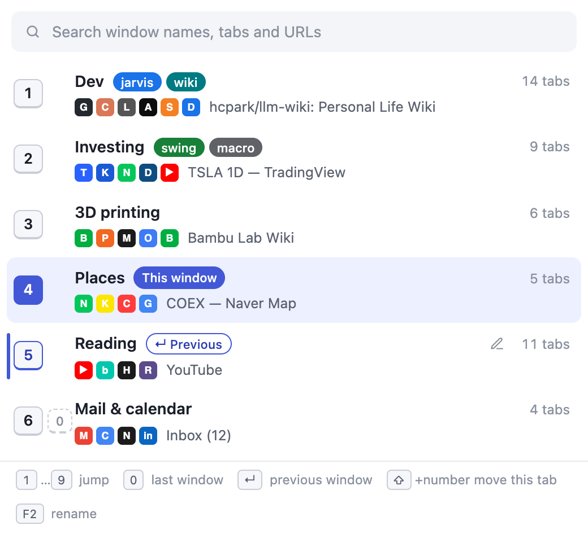

# Windial

Switch Chrome windows by number. One shortcut, one digit.

If you keep one window per topic, Chrome's own window switching is slow: `⌘`` cycles one window at a time and only shows whatever tab happens to be active. Windial opens a list where every window is recognisable at a glance, and pressing **1–9** (or **0** for the last window) takes you there.



## Keys

| Key | What it does |
|---|---|
| `⌥W` (Mac) / `Alt+W` (Windows, Linux) | Open the list; press it again to close. Change it at `chrome://extensions/shortcuts`. If Chrome could not assign it (key already taken), Windial opens a page that says so right after install. |
| `1` … `9` | Jump to that window. Numbers follow the order windows were opened and stay put. |
| `0` | Jump to the last window, however many there are. |
| `Enter` | Go to the previous window. It is preselected when the list opens. |
| type | Search window names, tab groups, tab titles and URLs. `Enter` opens the window *and* the matching tab. Digits still jump. |
| `⇧`+digit | Move the current tab into that window and follow it. Add `⌥`/`Alt` to move without following. |
| `⇧A` … | Windows 10 and up. |
| `F2` | Name the selected window. Empty name restores the default. |
| `Esc` | Clear the search, then close. |

## How windows are named

1. A name you typed (F2). It is matched to the window by its tabs, so it survives a Chrome restart.
2. Optional: a suggestion from Chrome's built-in on-device model (Gemini Nano). Turn it on in the options page. Needs Chrome 148+, about 22 GB free disk and a one-time model download. Nothing leaves the machine. Korean output is not officially supported by the model yet, so check the result.
3. Otherwise the site of the window's first tab, e.g. “Github”.

Tab groups appear as coloured chips next to the name; the favicon row and tab count complete the picture.

The toolbar icon carries a badge with the number of the window it sits in, so you can read a window's number without opening the list.

## Install (unpacked)

1. Open `chrome://extensions`, turn on **Developer mode**.
2. **Load unpacked** → pick this folder.
3. Optionally set your own shortcut at `chrome://extensions/shortcuts`.

## Development

The extension is plain files (`manifest.json`, `src/`, `_locales/`, `icons/`); there is no build step. Node is only needed for the tooling below.

```bash
npm install                 # Playwright, browser download skipped
npm run icons               # icons/icon.svg → PNG sizes
npm run shots               # store screenshots from the mock popup
npm run e2e                 # loads the extension into Chrome for Testing and checks real behaviour
HEADED=1 npm run e2e        # same, visibly (window focus events are only real when headed)
npm run pack                # dist/windial-<version>.zip for the Web Store
```

Open `src/popup.html?mock=1&lang=ko` (served over http, e.g. `node tools/serve.mjs`) to work on the UI with sample windows and no extension context. Add `&q=밤부` or `&shift=1` for the search and move states.

## Incognito

Allow the extension in incognito (`chrome://extensions` → Windial → Details → *Allow in Incognito*) and incognito windows join the list, numbered with the rest and marked. Nothing about them is written to disk: names you give them live only for the session, and the on-device naming option skips them. Chrome does not let tabs move between normal and incognito windows, so Shift+number greys those targets out.

## Languages

The UI follows Chrome's language: English, Korean, Japanese, Simplified Chinese, Spanish, German, French (`_locales/`). Translations were drafted by the author with machine help; corrections are welcome as pull requests.

## Privacy

No server, no network requests, no analytics. See [store/privacy-policy.md](store/privacy-policy.md).

## License

MIT
